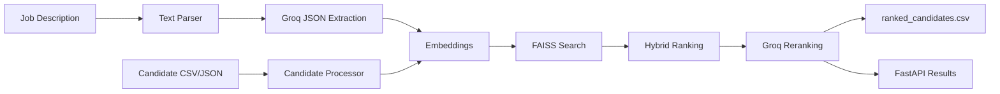

# AI-Powered Candidate Ranking System

Production-quality hackathon project for ranking candidates semantically against a job description. It combines document parsing, Groq-powered extraction and reranking, Sentence Transformer embeddings, FAISS vector search, and explainable hybrid scoring.

## Features

- Job description parsing from TXT, PDF, and DOCX.
- Candidate ingestion from CSV and JSON.
- Semantic matching with `sentence-transformers/all-MiniLM-L6-v2`.
- FAISS vector search with NumPy fallback.
- Hybrid weighted ranking across semantic fit, skills, experience, education, behaviour, and platform activity.
- Optional Groq LLM extraction and top-candidate reranking.
- FastAPI endpoints plus a small demo UI.
- CSV export with score breakdown and recruiter notes.
- Docker and test support.

## Architecture



## Folder Structure

```text
Indiaruns_Hackathon/
  app/
    api/
    embeddings/
    models/
    ranking/
    services/
    utils/
  data/
    sample_job/
    sample_candidates/
    uploads/
  docs/
  output/
  ppt/
  tests/
  config.py
  main.py
  requirements.txt
  Dockerfile
  docker-compose.yml
```

## Installation

```bash
python -m venv .venv
.venv\Scripts\activate
pip install -r requirements.txt
copy .env.example .env
```

Add `GROQ_API_KEY` to `.env` for LLM extraction and reranking. Without it, the project remains runnable with deterministic heuristics.

## Run

```bash
uvicorn app.api.main:app --reload
```

Open:

- UI: `http://127.0.0.1:8000`
- API docs: `http://127.0.0.1:8000/docs`
- Health: `http://127.0.0.1:8000/health`

## API Usage

```bash
curl -X POST "http://127.0.0.1:8000/upload-job" -F "file=@data/sample_job/ai_engineer_job.txt"
curl -X POST "http://127.0.0.1:8000/upload-candidates" -F "file=@data/sample_candidates/candidates.csv"
curl -X POST "http://127.0.0.1:8000/rank"
curl -O "http://127.0.0.1:8000/results"
```

## Output

`output/ranked_candidates.csv` contains:

- Rank
- Candidate ID
- Candidate name
- Overall score
- Semantic, skill, experience, education, behaviour, activity scores
- Confidence score
- Reason

## Docker

```bash
docker compose up --build
```

## Testing

```bash
pytest
```

## Screenshots

Add screenshots here after running the demo UI:

- Upload screen
- Ranking results
- Downloaded CSV

## Future Improvements

- Persistent database for jobs, candidates, and ranking runs.
- Authentication and recruiter workspaces.
- Bias monitoring and fairness reports.
- Human feedback loop for ranking calibration.
- ATS and LinkedIn/GitHub integrations.

## License

MIT License.
