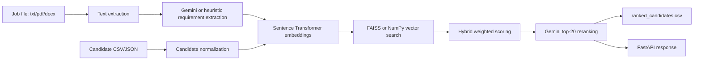

# Architecture

## Modules

- `app/utils`: file parsing, text cleaning, JSON helpers.
- `app/services`: job extraction, candidate normalization, Gemini adapter, orchestration pipeline.
- `app/embeddings`: embedding model and vector search abstraction.
- `app/ranking`: weighted score calculation and explainability.
- `app/api`: FastAPI endpoints and simple demo UI.

## Ranking Formula

`overall = 0.40 * semantic + 0.20 * skills + 0.15 * experience + 0.10 * education + 0.10 * behaviour + 0.05 * activity`

All weights are configurable through environment variables.
